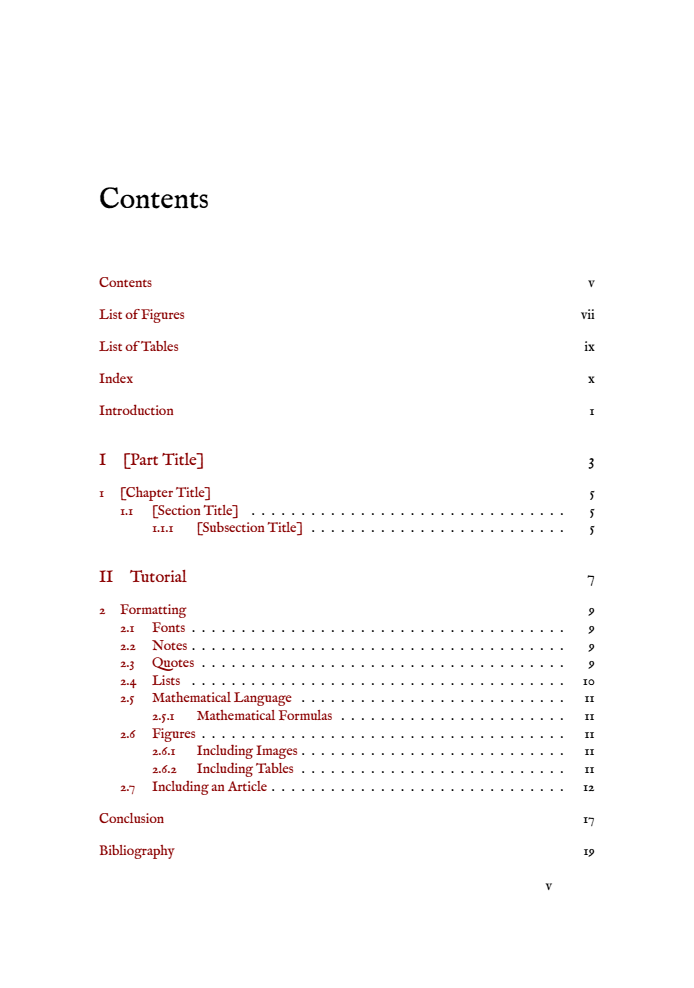

# UCL LaTeX PhD Thesis Template 

| Traditional                                                               | Modern                                                                     | Medieval |
| ------------------------------------------------------------------------- | -------------------------------------------------------------------------- |--- |
|  |  |  |

LaTeX template for a UCL scientific thesis with all the bells and whistles and the University College London (UCL)'s banner at the top, in accordance with [UCL's policy](https://www.ucl.ac.uk/brand/brand-essentials/ucl-logo). PhD thesis requirements can be found [here](https://www.ucl.ac.uk/students/exams-and-assessments/research-assessments/format-bind-and-submit-your-thesis-general-guidance).  


## Usage 

Compile [`thesisMain.tex`](https://github.com/Julie-Fabre/latexTemplates/blob/main/thesis/thesisMain.tex) or the [makefile](https://github.com/Julie-Fabre/latexTemplates/blob/main/thesis/makeFile_thesis). 

Three stylesheets are available: modern, classic and medieval. If using classic or medieval, these change the font and thus require the use of LuaLaTeX to compile them. To choose the stylesheet, simply edit line 3 in `thesisMain.tex` to either `\usepackage{styleSheets/modern}`, `\usepackage{styleSheets/classic}` or `\usepackage{styleSheets/medieval}`. 

If you're using [texmaker](https://www.xm1math.net/texmaker/) (which is awesome), set the QuickBuild command (Options>Configure Texmaker>Quick Build) to `lualatex -interaction=nonstopmode %.tex| bibtex %.aux| makeindex %.nlo -s nomencl.ist -o %.nls| lualatex -interaction=nonstopmode %.tex| evince %.pdf`

## Features

- Necessary UCL front matter:

| Declaration | Abstract  | Impact Statement    |
| ----------------------------------- | ----------------------------------- | ------------------------------------------- |
|  |  |  |

| Acknowledgements (optional)  | Paper Declaration Form | < |
| ----- | ----- | - |
|   |  |  |


- Table Of Contents, Figures, Ect. 
You can easily customize the chapter and part link color here - see the package [hyperref](https://ctan.org/pkg/hyperref).

| List of Figures | List of Tables  | Table of Contents    |
| ----------------------------------- | ----------------------------------- | ------------------------------------------- |
|  |  |  | 

- Main Thesis
  
| Text formating, notes | Citing, referencing, lists  | Maths,  Images   |
| ----------------------------------- | ----------------------------------- | ------------------------------------------- |
|  |  |  |

- Back matter

| Bibliography | Index (optional)  | Appendices (optional)   |
| ----------------------------------- | ----------------------------------- | ------------------------------------------- |
|  |  |  | 
  


## General LaTeX Tips

LaTeX is absolutely amazing, and can help you create gorgeous, professional-looking documents, but you might find it a little cryptic in the beginning. This is not a comprehensive survery of LaTeX (go check out other resources like [this one](https://en.wikibooks.org/wiki/LaTeX), [this one](https://www.cs.princeton.edu/courses/archive/spr10/cos433/Latex/latex-guide.pdf), or [this one](https://latex-tutorial.com/tutorials/) for that), but rather some tips and tricks that are usually hard to find but are very useful. I hope this helps! 

- **Trust LaTeX**: It was written and optimized so that the defaults look great. Try and respect the placements of floats (no `[H]`s everywhere). Only fine-tune and give the algorithm a helping hand (e.g., by using `H`, `/newpage` or `pagebreak`) at the way end, when your document is almost ready and a few placement errors remain. Also, remember that there hasn't been a bug in LaTeX for a while now. In all likelihood, if your code is not compiling, it contains a typo somewhere.
- **Compile often**: If you're starting out, you will make a few mistakes and typos. Compile often to spot them and fix them quickly.
- **Get into good habits**: If you open a `{` or `\begin{command}` (for instance `\begin{center}`), immedately place the closing one after (the `}` or  `\end(center)`). This helps ensure you don't forget it. 
- **Respect file naming conventions**: Don't give names to files that contain, for instance, spaces or accents. If your file name contains any underscores, you need to load/reference it with a backslash before this underscore (e.g. like this `your\_example.tex` and not like this `your_example.tex`).
- **Use a spellchecker**: How you set this up will depend on what software you're using to do LaTeX. There should be on option for spell check, and you should enable it. 

### LaTeX Tips for a Thesis

- **Controlling the Table of Contents**:
  - **Including chapters / other matter**: To include chapters or other matters in the Table of Contents (ToC), use the `\include{}` command for each chapter file. For other matter, such as List of Figures or List of Tables, you need to use commands like `\listoffigures` and `\listoftables`.
  - **Excluding chapter / other matter**:  To exclude specific chapters or sections from the ToC, use the `\chapter*{}` command instead of `\chapter{}`. For sections, use `\section*{}`.
  - **Controlling the table of contents depth**: The depth of the ToC can be controlled by the `\setcounter{tocdepth}{}` command. Here, the depth level is set with a number (e.g., `\setcounter{tocdepth}{2}` includes sections and subsections). To exclude sections, set the depth to a lower level.
- **Bibliography**
  - Generate BiBTeX entries using Mendeley, Zotero, Google Scholar.
  - To include a citation in your bibliography when you did not cite it in the text, use `\nocite{your_bib_ref_here}`.
  - Adjust the citation style 
    
### Debugging 
LaTeX can have some cryptic error messages when you're starting out. Hopefully this guide helps out! It's also important to know that while LaTeX tells you an error occured on line xx - that doesn't actually mean the error is on that line. It simply means that is where LaTeX noticed the error, and it is on *or before* the indicated line.  

#### Common `error messages`  and errors

- **`Missing \begin{document} or \end{document}`**: Ensure your document starts with `\begin{document}` and ends with `\end{document}`. All your style elements, packages and custom functions should be *before* the `begin{document}`.
- **`Undefined keyboard character`**: This usually means you've used a character LaTeX doesn't recognize. I've usually seen this when someone has copy -pasted text from Word or a PDF. You can have wierd symbols that appear as blank space - so check all your characters including your blank spaces. 
- **`Runaway argument?`**: Often caused by a missing brace (`{`, `}`) or delimiter (`$` `$$`, `begin{command}`, `\end{command}`, ...). 
- **`Missing $ inserted`**: Either :
    - in math mode, you have some mismatched `$`s (for instance `$a=1$$` should be either `$a=1$` or `$$a=1$$`).
    - you included "math mode" symbols outside of math mode. Frequent ones are `_` and `$`, which should always be preceded by an underscore: `\_`, `\$`. `^` is another one that needs particular attention - and there are a lot different ways of using that produce slightly different results- see a discussion [here](https://tex.stackexchange.com/questions/77646/how-to-typeset-the-symbol-caret-circumflex-hat/77647#77647) Other mistakes include all the Greek letters, which need to surround by $ symbols (for instance, `$\alpha$`). 
    - you included "non-math mode" commands in math mode. For instance, you cannot do `$y=f(x) \vskip2pt$` (the command `\vspkip` can't be used in math mode). Similarly, you cannot have any blank lines or `\par` commands in math mode. 
- **`Undefined control sequence`**: Usually a typo in a command name or a missing package that defines the command.
- **`Float(s) lost`**: Ensure your floats are correctly placed within the document and not left hanging at the end.
- **`File not found`**: Verify file paths and names, especially for external files like images.
- **`Extra alignment tab changed to \cr`**: This usually occurs in tables. Check for extra columns or misaligned text.
- **`Misplaced alignment tab character &`**: The alignment character `&` is used incorrectly. The alignment character `&` is used to align elements in specific environments, such as matrix, align, table etc. If you use it outside of thos environments (say, just in the text), you need to precede it with a backslash `\&`.
- **`Environment undefined`**: This is when you have a missing package. Ensure all required packages are installed and included in your preamble.
- **`Misplaced \noalign`**: This error appears when you have used `\hline` outside of a tabular environment.
- **`LaTeX Error: Something's wrong--perhaps a missing \item`**: This error appears when you have forgotten to include an `\item` command, for example:
  ```
  \begin{itemize}
  item 1
  \end{itemize}
  ```
  should be
   ```
  \begin{itemize}
  \item item 1
  \end{itemize}
  ```
- **Bibliography/Index not showing up**: Ensure you are compiling your document correctly (you need to first run LaTeX, LuaLaTeX or XeLaTeX, then generate the bibliography using bibtex, them make the index using makeindex and finally run LaTeX/LuaLaTeX/XeLaTeX again). Make sure there are no typos in your filenames and that you're using the appropriate commands for bibliography and index.
- **Using LaTeX Instead of XeLaTeX or LuaLaTeX**: Certain features, especially font handling and Unicode support, require XeLaTeX or LuaLaTeX instead of LaTeX. 
  
#### Debugging strategies 
- **Check the prime suspects**: Start by looking at the line number indicated in the error message. However, the actual issue might have originated earlier in the document.
- **Trial and error**: Comment out suspicious lines or insert `\end{document}` at different points to isolate the error.
- **Add more error context**: Use `\setcounter{errorcontextlines}{1000}` in your preamble to get more (sometimes too much) context for errors.

### Getting things in the correct spot and correctly spaced

LaTeX arranges floats (figures) and page breaks automatically. This can sometimes result in odd behavior where for instance a figure is pages after it is defined first, or there is a pagebreak just after a title. There are a few things that can help with this: 
- **Use tildes for non-breakable space**: The tilde symbol `~` creates a non-breakable space. Use this for instance in figure references or when citing ot refering to somehting else(e.g., `Figure~1`, `blabla~\cite{bla2008}`).
- **`\FloatBarrier`**: This command from the `placeins` package restricts the floating of figures or tables beyond the point where `\FloatBarrier` is placed. It ensures that all floats are processed before the document continues, which is particularly useful in keeping figures and tables in their relevant sections.
- **`\\*` and `\nopagebreak`**: `\\*` prevents a page break after a line, while `\nopagebreak` discourages page breaking at its location. These are useful for keeping lines or paragraphs together on the same page.
- **`\usepackage[nobottomtitles*]{titlesec}`**: This command is used to import and configure the `titlesec` package with the `nobottomtitles*` option. This option ensures that chapter or section titles are not placed at the very bottom of a page, thus maintaining a cleaner and more readable layout. The titlesec package offers extensive control over the formatting of titles, headers, and footers in your document.
- **`\@`**: In LaTeX, the spacing after a period (full stop) is treated differently depending on whether LaTeX interprets the period as ending a sentence or as part of an abbreviation. By default, LaTeX assumes that a period after a capital letter is part of an abbreviation and therefore does not place as much space after it as it would after a period that it interprets as ending a sentence. To explicitly indicate to LaTeX that a period after a capital letter marks the end of a sentence, you can use the `\@` command before the period. 
- **`\ldots`**: To generate an ellipsis (three dots), use the `\ldots` command in LaTeX. This command ensures that the spacing between the dots is consistent and typographically correct. Other options include `\textellipsis` from the package `textcomp`, it is sometimes better-behaved) and `\dots` (for math).

Finally, at the very end of your writing process, if there are a few remaining issues:
- **Force page breaks**: add `\pagebreak` or `\newpage` wherever necessary to get things to make more sense.
- **Force figures to stay put**: use `[H]`, `[t]`, `[b]`, and/or `[!]` in your figure environment to better control their placement. For example, `\begin{figure}[H]` will "force" the figure to stay exactly where it is in the code.
- **Adjust spacing**: If you're facing issues with spacing, such as too much space between items or sections, you can use commands like `\vspace{-5mm}` to reduce vertical space or `\hspace{-5mm}` for horizontal space. These commands give you more control over the exact spacing in your document, allowing for fine-tuning of layout and presentation. Remember to use these sparingly and with caution, as they can disrupt LaTeX's natural spacing algorithms.

### Finding packages and getting help
- Search for more packages here: [CTAN](https://ctan.org/) using keywords or package names. CTAN also suggests similar packages when you click on one. Chances are, whatever you're looking for, someone has written an awesome package for it. 
- Get help:
  - https://tex.stackexchange.com/
  - https://texfaq.org/
  - https://tug.org/mailman/listinfo/texhax/
  - https://latex.org/forum/
  - https://www.reddit.com/r/LaTeX/ 
  - more resources: https://tug.org/interest.html#texhelp

